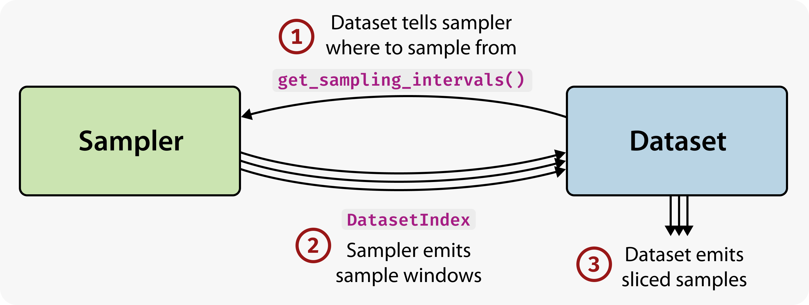
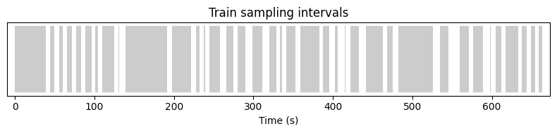
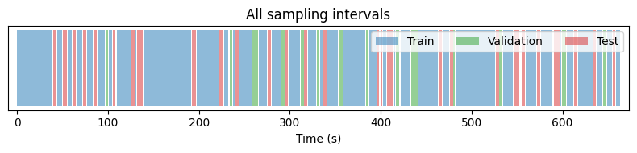
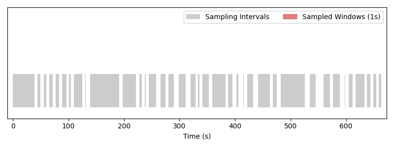
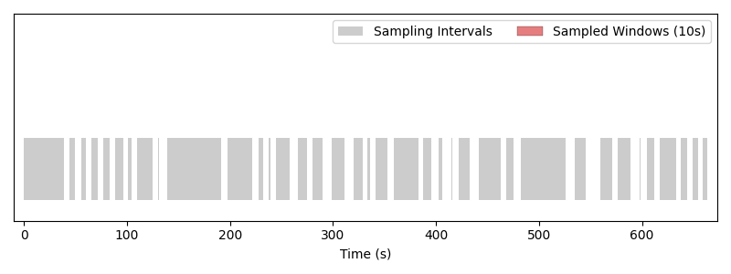
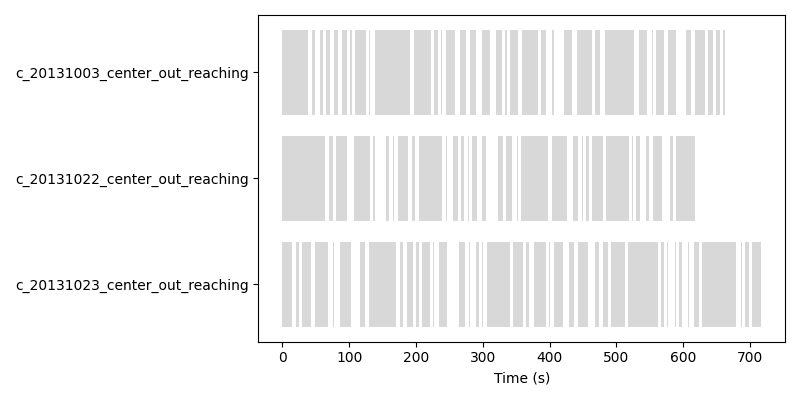

.. _sampling_guide:

.. currentmodule:: torch_brain.samplers

Data Sampling
=============

Neural recordings are rarely tidy. A single session typically contains
periods of task engagement separated by long inter-trial intervals,
short artifacts that need to be excluded, and stretches where only a
subset of channels were recording cleanly. Different downstream tasks
also want different views of the same data — a decoder might train on
1-second windows while a self-supervised model trains on 10-second
ones — and real experiments often span multiple sessions or subjects
that have to be sampled from jointly.

**torch_brain** is designed around these realities. One of our major
design goals is to make it easy to sample *arbitrary* time windows
from multi-recording datasets, without having to reprocess the
underlying data every time the training recipe changes.

In this guide you will learn:

- what *sampling intervals* are, and how they tell a sampler where
  it is allowed to sample from,
- how to get these sampling intervals from a :obj:`Dataset`,
- how to use the built-in samplers to generate fixed or variable length
  windows for training and evaluation,
- and how the same setup scales seamlessly to datasets that contain
  multiple recordings.

Concept: *Sampling Intervals*
-----------------------------

Sampling intervals are *Intervals* from which a data sampler is allowed
to sample data.

In **torch_brain**, the primary way of sampling is using *continuous
time* intervals. This is achieved with the following design:

- :obj:`Dataset` tells the sampler where it is
  allowed to sample from. This is achieved with the
  :obj:`~Dataset.get_sampling_intervals` method.
-  The sampler uses this information to create samples, which are
   effectively :math:`(t_{start}, t_{end})` pairs emitted as a
   :obj:`DatasetIndex` object.
-  :obj:`Dataset` uses this sample information to load and slice
   the data samples.

   Interplay between Dataset and Sampler.

.. tip::

   Typically, all this is orchestrated by a PyTorch :obj:`~torch.utils.data.DataLoader`.
   In this guide, we will go through the logic of sampling *manually*,
   to give you a more fundamental understanding of these concepts.
   See
   :doc:`this </generated/notebooks/nlb_maze_minimal_example>` minimal
   training example for how it all fits with a DataLoader.

Datasets in **torch_brain** typically contain multiple recordings, and
so we define sampling intervals as *dictionaries* keyed by the recording
IDs. Each entry is a :obj:`torch_brain.data.Interval` object that specifies
the valid start and end sampling times for that recording:

.. code:: python

   sampling_intervals = {
       "recording_id1": Interval(...),
       "recording_id2": Interval(...),
       ...
   }

These intervals do not have to be contiguous, and can be of any length.

Many **brainsets** provide default train/validation/test sampling
intervals. For example, let’s load a single recording in the
:obj:`~torch_brain.datasets.PerichMillerPopulation2018` dataset.

.. code:: pycon

    >>> from torch_brain.datasets import PerichMillerPopulation2018

    >>> dataset = PerichMillerPopulation2018(
    ...     root="./data/processed",
    ...     recording_ids=["c_20131003_center_out_reaching"],
    ... )
    >>> sampling_intervals = dataset.get_sampling_intervals("train")
    >>> print(sampling_intervals)
    {'c_20131003_center_out_reaching': LazyInterval(
      end=<HDF5 dataset "end": shape (38,), type "<f8">,
      start=<HDF5 dataset "start": shape (38,), type "<f8">
    )}

We note that there are a total of 38 sampling intervals for the train
part of the recording. Let’s print the first 5:

.. code:: pycon

    >>> for recording_id in sampling_intervals:
    ...     for start, end in zip(sampling_intervals[recording_id].start[:5], sampling_intervals[recording_id].end[:5]):
    ...         print(f"start: {start:.2f}, end: {end:.2f}")
    start: 0.00, end: 38.51
    start: 44.02, end: 49.32
    start: 55.78, end: 60.20
    start: 65.15, end: 71.30
    start: 77.15, end: 83.56

Notice that the intervals are of different lengths. Visually, they look like:

   Train sampling intervals for one recording. Each gray block marks
   an interval that a sampler is allowed to draw from.

The same dataset also exposes validation and test splits via
``get_sampling_intervals("valid")`` and ``get_sampling_intervals("test")``.
Overlaying all three shows how the brainset partitions the recording:

   Train, validation, and test sampling intervals on the same recording.

Samplers in action
------------------

**torch_brain** provides a number of samplers that can be used to
generate samples for training, or evaluation. For example,

.. list-table::
   :widths: 25 125

   * - :obj:`~torch_brain.samplers.SequentialFixedWindowSampler`
     - A Sequential sampler, that samples fixed-length windows.
   * - :obj:`~torch_brain.samplers.RandomFixedWindowSampler`
     - A Random sampler, that samples fixed-length windows.
   * - :obj:`~torch_brain.samplers.TrialSampler`
     - A sampler that randomly samples a full contiguous interval without slicing it into windows.

RandomFixedWindowSampler
~~~~~~~~~~~~~~~~~~~~~~~~

The most common sampler used in practice is the
:obj:`~torch_brain.samplers.RandomFixedWindowSampler`,
which randomly samples windows of a fixed length from the data.

.. code:: pycon

    >>> from torch_brain.samplers import RandomFixedWindowSampler

    >>> sampler = RandomFixedWindowSampler(
    ...     sampling_intervals=dataset.get_sampling_intervals("train"),
    ...     window_length=1.0,
    ... )

    >>> print("Number of sampled windows in one epoch: ", len(sampler))
    WARNING:root:Skipping 1.8665333333332796 seconds of data due to short intervals. Remaining: 417.0 seconds.
    Number of sampled windows in one epoch:  417

This sampler will generate exactly 417 samples, and some small isolated
intervals of total length 1.86 seconds are skipped because they are too
short to sample 1 second windows from.

We can visualize what the sampler is doing as we are iterating over it.

.. code:: pycon

    >>> for i, sample_index in enumerate(sampler):
    ...     print(f"Sample between {sample_index.start:.2f} and {sample_index.end:.2f}")
    Sample between 251.01 and 252.01
    Sample between 257.01 and 258.01
    Sample between 453.49 and 454.49
    Sample between 121.92 and 122.92
    Sample between 422.79 and 423.79
    ...

   Windows of length 1 s drawn by the random fixed-window sampler.
   Each red block is one sample placed over the gray sampling
   intervals.

Note that the order of the samples is shuffled, and that temporal jitter
is used, so that the windows are not sampled at the same time from epoch
to epoch.

We can also easily change the window length of the sampler to get
different sized windows. This flexibility is achieved without having to
reprocess the underlying data.

.. code:: pycon

    >>> sampler = RandomFixedWindowSampler(
    ...     sampling_intervals=dataset.get_sampling_intervals("train"),
    ...     window_length=10.0,
    ... )
    >>> print("Number of sampled windows in one epoch: ", len(sampler))
    WARNING:root:Skipping 113.86756666666673 seconds of data due to short intervals. Remaining: 270.0 seconds.
    Number of sampled windows in one epoch:  27

    >>> for i, sample_index in enumerate(sampler):
    ...     print(f"Sample between {sample_index.start:.2f} and {sample_index.end:.2f}")
    Sample between 28.51 and 38.51
    Sample between 158.61 and 168.61
    Sample between 244.77 and 254.77
    Sample between 114.41 and 124.41
    Sample between 535.77 and 545.77
    ...

   Same sampler with a window length of 10 seconds. Larger windows
   mean fewer samples per epoch, and short intervals get skipped
   because no 10 s window fits inside them.

While we're at it, let's also look at the other two samplers:

SequentialFixedWindowSampler
~~~~~~~~~~~~~~~~~~~~~~~~~~~~

.. code:: pycon

    >>> from torch_brain.samplers import SequentialFixedWindowSampler

    >>> sampler = SequentialFixedWindowSampler(
    ...     sampling_intervals=dataset.get_sampling_intervals("train"),
    ...     window_length=10.0,
    ...     drop_short=True,
    ... )
    >>> print("Number of sampled windows in one epoch: ", len(sampler))
    WARNING:root:Skipping 113.86756666666673 seconds of data due to short intervals. Remaining: 420.0 seconds.
    Number of sampled windows in one epoch:  42

    >>> for i, sample_index in enumerate(sampler):
    ...     print(f"Sample between {sample_index.start:.2f} and {sample_index.end:.2f}")
    Sample between 0.00 and 10.00
    Sample between 10.00 and 20.00
    Sample between 20.00 and 30.00
    Sample between 28.51 and 38.51
    Sample between 109.40 and 119.40
    ...

   Sequential fixed-window sampler with a window length of 10
   seconds. Windows tile each interval from left to right without
   overlap, and in deterministic order.

TrialSampler
~~~~~~~~~~~~

A :obj:`~torch_brain.samplers.TrialSampler` treats each interval start-end pair as
a *"trial"*, and samples them as whole.

.. code:: pycon

    >>> from torch_brain.samplers import TrialSampler

    >>> sampler = TrialSampler(
    ...     sampling_intervals=dataset.get_sampling_intervals("train"),
    ...     shuffle=True,
    ... )
    >>> print("Number of sampled windows in one epoch: ", len(sampler))
    Number of sampled windows in one epoch:  38

    >>> for i, sample_index in enumerate(sampler):
    ...     print(f"Sample between {sample_index.start:.2f} and {sample_index.end:.2f}")
    Sample between 227.69 and 232.62
    Sample between 637.58 and 644.05
    Sample between 415.17 and 415.69
    Sample between 319.86 and 328.74
    Sample between 421.70 and 432.91
    ...

   The trial sampler returns each interval as-is, so samples are
   *variable-length* and follow the trial structure of the data.

Notice that the samples are *variable-length* in this case!

From a sample to a data slice
-----------------------------

All three samplers above emit the same kind of object: a
:obj:`DatasetIndex`. It is a small dataclass that records *where* a
sample comes from — which recording, and which time window:

.. code:: python

   @dataclass
   class DatasetIndex:
       recording_id: str
       start: float
       end: float

These three fields are everything a :obj:`Dataset` needs to load a
sample. Indexing the dataset with a :obj:`DatasetIndex` returns a
:obj:`torch_brain.data.Data` object containing just that time slice of
the underlying recording:

.. code:: pycon

    >>> sample_index = next(iter(sampler))
    >>> sample_index
    DatasetIndex(recording_id='c_20131003_center_out_reaching', start=660.13, end=661.13)

    >>> data = dataset[sample_index]
    >>> data
    Data(
      spikes=IrregularTimeSeries(timestamps=..., unit_index=...),
      cursor=IrregularTimeSeries(timestamps=..., pos=..., vel=...),
      trials=Interval(...),
      ...
    )
    >>> data.start, data.end, data.absolute_start
    0.0, 1.0, 660.13

This is the bridge between sampling and data loading: the sampler
emits a stream of :obj:`DatasetIndex` objects, and the
:obj:`Dataset` turns each one into a sliced
:obj:`~torch_brain.data.Data` sample.

Sampling from multiple recordings
---------------------------------

The sampler seamlessly works with datasets containing multiple
recordings. For example, we can create a dataset with multiple
recordings:

.. code:: pycon

    >>> dataset = PerichMillerPopulation2018(
    ...     root="./data/processed",
    ...     recording_ids=[
    ...         "c_20131003_center_out_reaching",
    ...         "c_20131022_center_out_reaching",
    ...         "c_20131023_center_out_reaching",
    ...     ],
    ... )
    >>> print(dataset.get_sampling_intervals("train"))
    {'c_20131003_center_out_reaching': LazyInterval(
      end=<HDF5 dataset "end": shape (38,), type "<f8">,
      start=<HDF5 dataset "start": shape (38,), type "<f8">
    ), 'c_20131022_center_out_reaching': LazyInterval(
      end=<HDF5 dataset "end": shape (33,), type "<f8">,
      start=<HDF5 dataset "start": shape (33,), type "<f8">
    ), 'c_20131023_center_out_reaching': LazyInterval(
      end=<HDF5 dataset "end": shape (40,), type "<f8">,
      start=<HDF5 dataset "start": shape (40,), type "<f8">
    )}

The same :obj:`~Dataset.get_sampling_intervals` method is used as before, and the
sampling intervals dictionary has three elements, corresponding to the
three recordings.

The sampler can be initialized in the same way as before.

.. code:: pycon

    >>> sampler = RandomFixedWindowSampler(
    ...     sampling_intervals=dataset.get_sampling_intervals("train"),
    ...     window_length=1.0,
    ... )
    >>> print("Number of sampled windows in one epoch: ", len(sampler))
    WARNING:root:Skipping 8.784433333333283 seconds of data due to short intervals. Remaining: 1233.0 seconds.
    Number of sampled windows in one epoch:  1233

    >>> for i, sample_index in enumerate(sampler):
    ...     print(
    ...         f"Sample between {sample_index.start:.2f} and {sample_index.end:.2f} "
    ...         f"from recording {sample_index.recording_id}"
    ...     )
    Sample between 349.16 and 350.16 from recording c_20131023_center_out_reaching
    Sample between 180.99 and 181.99 from recording c_20131022_center_out_reaching
    Sample between 33.14 and 34.14 from recording c_20131023_center_out_reaching
    Sample between 167.72 and 168.72 from recording c_20131003_center_out_reaching
    Sample between 141.72 and 142.72 from recording c_20131003_center_out_reaching
    ...

We visualize this below:

   Sampling across three recordings simultaneously. Each row shows
   one recording's intervals (gray) and the windows drawn from them
   (red); samples interleave freely across recordings.

Further Reading
---------------

The pieces covered above — sampling intervals, samplers, and
multi-recording datasets — work with a normal PyTorch training loop.
For a worked end-to-end example that brings these together, see the
:doc:`NLB Maze minimal example </generated/notebooks/nlb_maze_minimal_example>`.
It walks through:

- defining a custom :obj:`Dataset` with sampling intervals tailored
  to your use case,
- wiring a sampler into a :class:`~torch.utils.data.DataLoader`, and
- iterating batches into a model for training and evaluation.
